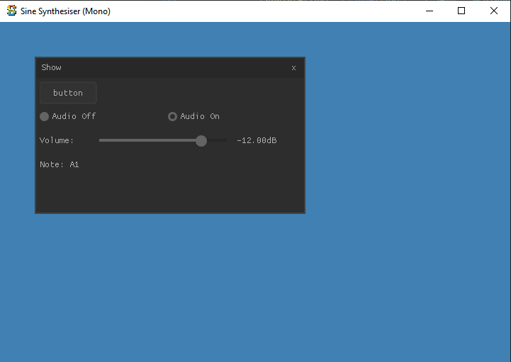

Me playing around with boilerplate code for cross platform, single instance, standalone apps.

The result is a pretty neat playable Sine wave synth ([see here](src\nuklear-sapp.c)) with an ImGUI interface. The main app code is ~300 lines and compiles in < 1sec, making it a great template for rapid prototyping of new DSP ideas.

As you can see above there is a radio audio on/off control, volume in dB, and a label displaying the currently held note

'button' does nothing....

### Building
Only tested on Windows 10 & MacOS 12

Use CMake a select the `sokolnuklear` target

### Libraries used:
- [sokol](https://github.com/floooh/sokol) - sokol_app.h, sokol_audio.h, sokol_gfx.h, sokol_glue.h, sokol_nuklear.h. Handles tjhe OS specific application window, graphics backend initialisation (DX11 & Metal), and audio thread. 
- [nuklear](https://github.com/Immediate-Mode-UI/Nuklear) Immediate mode GUI library. Used as a quick & easy tool to use to get controls working
- [thread.h](https://github.com/mattiasgustavsson/libs) C11 style threads & atomics. Used by the MIDI thread.
- [ringbuffer.h](https://github.com/dhess/c-ringbuf) One the first results I found when googling for a ring buffer. The MIDI thread write to a ring buffer, and the audio thread reads it.
- [RtMidi](https://github.com/thestk/rtmidi) Search for and read from MIDI ports

### Notes
- Audio I/O is 1 output (mono), zero inputs. You can change this by adjusting the settings in **sokol_audio** 
- The MIDI thread will automatically try to connect to the first available port (index: 0). If you have multiple MIDI input ports available, you may need to change this behaviour...
- You will notice some Dear ImGUI code floating around the codebase. In the beginning I was comparing Dear ImGUI with Nuklear and decided against Dear ImGui due to more files, slightly longer build times, and increased binary size. If want to use this template and you prefer using Dear ImGUI, you'll have no problem copy/pasting the audio and MIDI code to the [main source file](src\cimgui-sapp.c)